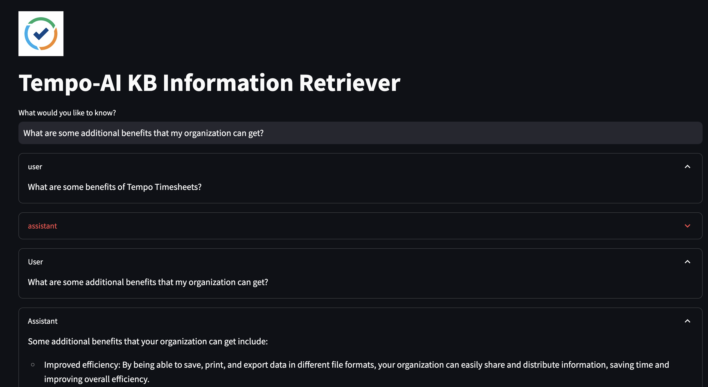
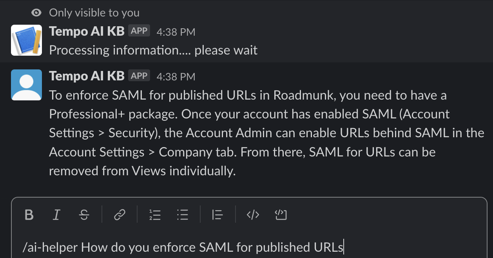

# Tempo AI Knowledge Base

The AI Knowledge Base (AIKB) will be a one-stop-shop for ALL information retrieval across all Tempo products.
The application is deployed as both a web app (using Streamlit) and a Slack app.

## Getting Started

Before you begin, make sure to install all the required libraries listed in the `requirements.txt` file. It is recommended that you set up your environment within a virtual environment. Additionally, there is a Dockerfile avaialble which will be pushed to ECR.

### Web App

To run the web app:

1. Navigate to the project directory.
2. Open your terminal and execute the following command to start the Streamlit application:

   ```bash
   streamlit run app.py

The web app should now be up and running. See below for a preview of how the app should appear when correctly set up.




### Slack App

The Slack app setup involves a few additional steps, as it requires access to the Slack account you're using and adjustments to public URLs provided by Ngrok. To avoid a completely new set up, I am happy to share the present Slack workspace being used, and the required authentication to use the AI App.

1. Start by installing Ngrok on your local machine.
2. Run the slackgpt.py script locally by running `sudo python slackgpt.py`. By default, it runs on 127.0.0.1:80.
3. Launch Ngrok with the following command:

    ```bash
    ngrok http 80

4. Copy the public URL provided by Ngrok.
5. Access the Slack app [settings page](https://api.slack.com/apps). Kindly reach out for more details on using the existing app
6. Update the Slash Commands request URL to reflect the new URL provided by Ngrok.
7. In your Slack workspace, type /ai-helper and ask your question to interact with the app. See sample request and response below


